# PR Agent - Zero Touch Architecture

## System Overview
Fully automated PR governance system with Risk Analysis, Auto-Close, and Auto-Merge capabilities.

## High-Level Architecture

```mermaid
graph LR
    %% Defines styles for different types of components
    classDef actor fill:#f9f,stroke:#333,stroke-width:2px;
    classDef external fill:#e1ecf4,stroke:#333,stroke-width:2px,stroke-dasharray: 5 5;
    classDef aws fill:#ff9900,stroke:#333,stroke-width:2px,color:white;
    classDef brain fill:#9a6dd7,stroke:#333,stroke-width:2px,color:white;
    classDef writer fill:#4caf50,stroke:#333,stroke-width:2px,color:white;
    classDef email fill:#ff5722,stroke:#333,stroke-width:2px,color:white;

    %% Actors and External Systems
    Dev(👨💻 Developer):::actor
    GH(🐙 GitHub<br/>Source Control & CI):::external
    AI(🤖 Gemini 2.5 Flash<br/>AI Analysis API):::external
    Jira(📋 Jira<br/>Audit & Ticketing):::external

    %% Main Cloud Infrastructure Block
    subgraph "☁️ AWS Cloud Infrastructure - Serverless"
        GW(⚡ Gateway Lambda<br/>1. Ingest & Auto-PR):::aws
        Brain(🧠 Brain Lambda<br/>2. Logic & Governance):::brain
        Writer(✍️ Writer Lambda<br/>3. GitHub & Email):::writer
        SES(✉️ AWS SES<br/>Notifications):::email
    end

    %% Major Data Flows
    %% Stage 1: Ingestion
    Dev -- "1. Push / Comment" --> GH
    GH -- "2. Webhook Event" --> GW
    
    %% Stage 2: Logic & AI
    GW -- "3. Trigger Analysis" --> Brain
    Brain -- "4. Analyze Risk" --> AI
    AI -- "5. Return Score" --> Brain

    %% Stage 3: Execution (The "Hands")
    Brain -- "6. Request Action" --> Writer
    Writer -- "7. API Action" --> GH
    Writer -- "7a. Send Email" --> SES
    
    %% Audit Trail
    Brain -- "8. Sync Status" --> Jira

    %% Links for clearer layout
    linkStyle 0 stroke-width:2px,fill:none,stroke:black
    linkStyle 1 stroke-width:3px,fill:none,stroke:#ff9900
    linkStyle 2 stroke-width:3px,fill:none,stroke:#ff9900
    linkStyle 5 stroke-width:3px,fill:none,stroke:#4caf50
    linkStyle 7 stroke-width:3px,fill:none,stroke:#ff5722
```



## Detailed Flow Diagrams

### Flow 1: Zero Touch - Push to Auto-PR


### Flow 2: Risk Analysis - High Risk Path

```mermaid
sequenceDiagram
    participant GH as GitHub
    participant GW as Gateway
    participant BR as Brain Lambda
    participant GM as Gemini API
    participant JR as Jira
    
    GH->>GW: PR Opened/Synced
    GW->>BR: Trigger Risk Analysis
    BR->>GH: Set Status: Pending
    BR->>GM: Analyze PR Changes
    Note over GM: Reviews code, checks<br/>incident history
    GM-->>BR: Risk Level: HIGH
    BR->>GH: Set Status: FAILURE
    BR->>GH: Close PR
    BR->>JR: Create Approval Ticket
    BR->>GH: Comment: "⛔ Blocked - High Risk"
    Note over GH: PR is CLOSED<br/>Merge button disabled
```



### Flow 3: Approval Workflow

```mermaid
sequenceDiagram
    participant User as Approver
    participant GH as GitHub
    participant GW as Gateway
    participant BR as Brain Lambda
    participant JR as Jira
    
    User->>GH: Comment: "approved"
    GH->>GW: Webhook: issue_comment
    GW->>BR: Handle Approval
    BR->>GH: Set Status: SUCCESS
    BR->>GH: Reopen PR
    BR->>GH: Merge PR
    BR->>JR: Update Ticket: Approved
    BR->>GH: Comment: "✅ Approved & Merged"
    Note over GH: PR is MERGED<br/>Branch deleted
```



### Flow 4: Happy Path - Auto-Merge


## Component Details

### 1. GitHub-PR-Risk-Reviewer (Gateway Lambda)
- **Purpose**: Entry point for all GitHub events
- **Events Handled**:
  - `push` → Auto-PR creation
  - `pull_request` → Risk analysis trigger
  - `issue_comment` → Command routing
- **Fast Path Operations**: Branch creation, deletion, listing (no AI needed)

### 2. PR-Agent-Brain (Brain Lambda)
- **Purpose**: Risk analysis and decision engine
- **Key Functions**:
  - AI-powered risk assessment via Gemini
  - Approval workflow management
  - Auto-Close/Auto-Merge logic
  - Jira integration
  - GitHub status checks

### 3. PR-Agent-GitHub-Writer (Writer Lambda)
- **Purpose**: GitHub API operations
- **Operations**:
  - Post comments
  - Create/delete branches
  - Manage PR state

### 4. External Services
- **Google Gemini API**: AI risk analysis using incident history and policies
- **Jira API**: Governance audit trail and approval tracking
- **AWS SES**: Email notifications for high-risk PRs

## Data Flow


## Security & Governance

### Zero Trust Enforcement
1. **All** code changes trigger AI analysis
2. High-risk PRs are **physically closed** (Free Tier workaround)
3. Approval requires explicit human comment
4. Every action logged to Jira

### Audit Trail
- **GitHub Comments**: Timestamped decision records
- **Jira Tickets**: Approval requests and outcomes
- **Status Checks**: Visual PR state indicators
- **Lambda Logs**: Full event trace in CloudWatch

## Configuration

### Required GitHub Webhook Events
- ✅ Pushes
- ✅ Pull requests
- ✅ Issue comments

### Environment Variables
```bash
# Gateway Lambda
GITHUB_TOKEN=<PAT with repo access>

# Brain Lambda
GITHUB_TOKEN=<PAT with repo access>
GOOGLE_API_KEY=<Gemini API key>
```

## Key Features

| Feature | Description | Benefit |
|---------|-------------|---------|
| **Auto-PR** | Creates PR on branch push | Zero manual PR creation |
| **Risk Analysis** | AI evaluates every change | Prevents bad code |
| **Auto-Close** | Blocks high-risk PRs | Free Tier enforcement |
| **Auto-Merge** | Merges safe PRs | Faster deployment |
| **Jira Sync** | Audit trail | Compliance ready |
| **Status Checks** | Visual indicators | Clear PR state |

## Workflow Summary

```
Developer Push
    ↓
Auto-PR Created
    ↓
AI Risk Analysis
    ↓
┌─────────────┬──────────────┐
│   HIGH      │     LOW      │
│   RISK      │     RISK     │
└─────────────┴──────────────┘
    ↓                ↓
Auto-Close      Auto-Merge
    ↓                ✓
Approval?
    ↓
Reopen + Merge
    ✓
```

## Performance Metrics
- **Gateway Latency**: ~500ms (event routing)
- **Risk Analysis**: ~3-5s (Gemini API call)
- **Auto-Merge**: ~2s (GitHub API)
- **End-to-End**: ~8s (Push → Merge for low risk)

---

**Status**: ✅ Production Ready | **Version**: 2.0 | **Last Updated**: 2026-01-17
